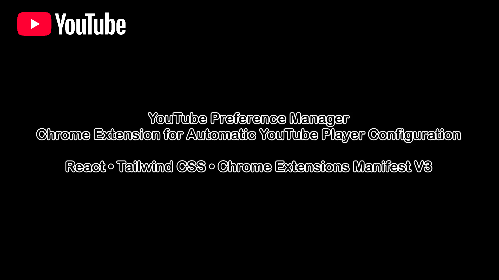
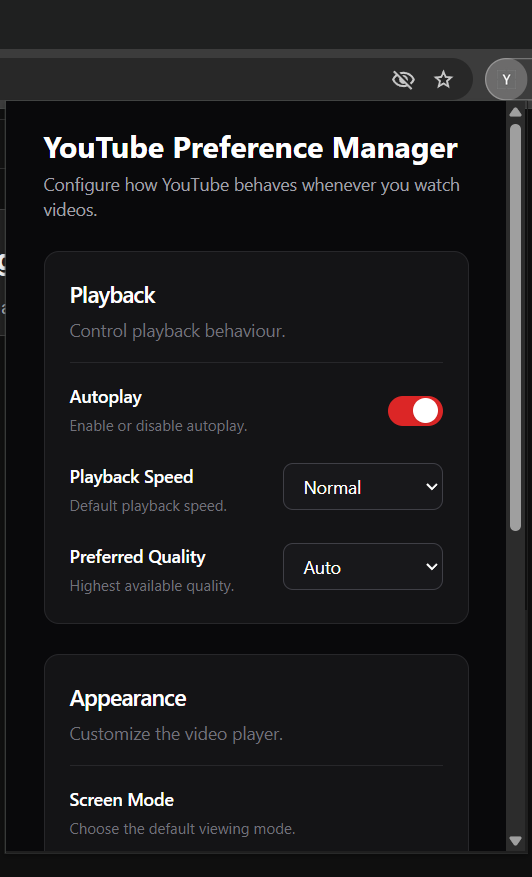
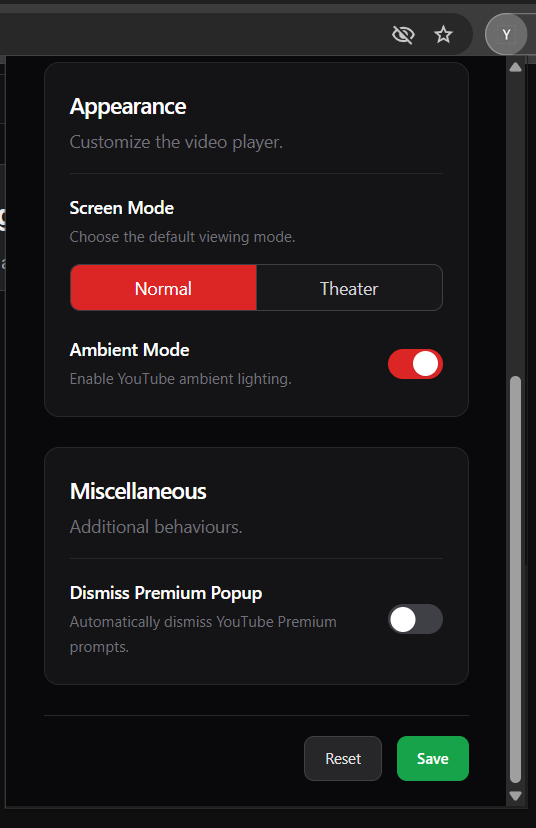
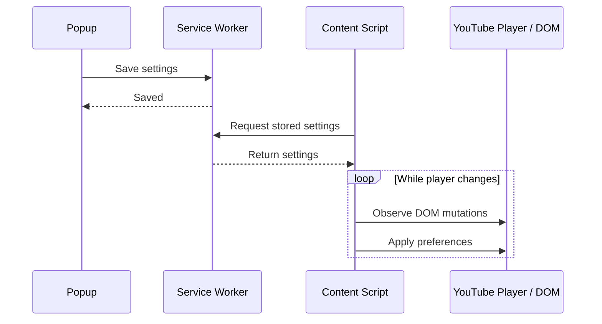
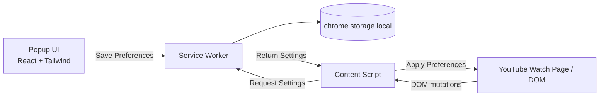

# YouTube Preference Manager

A Chrome extension that stores and automatically applies your preferred YouTube playback and viewing settings whenever you open a video.

Instead of manually configuring options such as playback speed, video quality, viewing mode, autoplay, or ambient mode for every session, the extension remembers your preferences and applies them automatically whenever a YouTube video is opened.

Built with React, Tailwind CSS, and the Chrome Extensions Manifest V3 API, the extension uses `MutationObserver`s and Chrome's messaging APIs to synchronize user preferences with YouTube's dynamically changing interface.

## Demo

A brief walkthrough demonstrating preference configuration, automatic synchronization with the YouTube player and persistence in the browser.

[](https://youtu.be/RlKmdlfioEo)

## Screenshots

| | |
|--|--|
|  |  |

## Features

- Automatically apply preferred playback speed
- Automatically apply preferred video quality
- Automatically apply preferred viewing mode (Default or Theater)
- Automatically toggle autoplay
- Automatically toggle ambient mode
- Automatically dismiss the YouTube Premium pop-up
- Persist preferences across browsing sessions

> **Note**
>
> Earlier versions of the extension also supported entering Full Screen mode. This functionality relied on browser behavior that now requires a direct user gesture before entering fullscreen, making it incompatible with current Chrome security restrictions. As a result, Full Screen mode is no longer supported.
>

## Tech Stack

- React
- Tailwind CSS
- Vite
- Chrome Extensions Manifest V3
- Chrome Storage API
- Chrome Runtime Messaging API
- DOM `MutationObserver` API

## Table of Contents

- [How It Works](#how-it-works)
- [System Architecture](#system-architecture)
- [Installation](#installation)
- [Project Structure](#project-structure)
- [Limitations](#limitations)
- [Future Improvements](#future-improvements)

## How It Works

When a user saves their preferences through the extension popup, the settings are stored using Chrome's local storage.

Whenever a YouTube watch page is opened—or when YouTube navigates between videos without a full page reload—the content script requests the stored preferences from the service worker. After receiving them, it monitors the YouTube player using `MutationObserver`s and applies the configured options as soon as the relevant controls become available.

Because YouTube dynamically updates portions of the page without performing full page reloads, the content script continues observing the player and reapplies preferences whenever necessary.




## System Architecture

The extension follows the Chrome Extensions Manifest V3 architecture and is organized into three independent components.

### Popup UI

A React-based interface used to configure and save user preferences.

### Service Worker

Acts as the extension's background process. It stores preferences using `chrome.storage.local`, allowing them to persist across browser sessions without requiring a backend service. It also serves as the communication bridge between the popup and content script.

### Content Script

Runs on YouTube watch pages. It retrieves stored preferences, observes changes to the page, and applies the configured settings by interacting directly with the YouTube player controls.



## Installation

### Clone the repository

```bash
git clone https://github.com/swstk-p/yt-preference-manager.git
cd yt-preference-manager/extension
```

### Install dependencies

```bash
npm install
```

### Build the extension

```bash
npm run build:ext
```

### Load the extension into Chrome

1. Open **chrome://extensions**.
2. Enable **Developer mode**.
3. Click **Load unpacked**.
4. Select the generated extension directory: `extension/dist`.
5. Open a YouTube watch page.
6. Configure your preferences through the extension popup.
7. Save the settings. They will be applied automatically whenever a YouTube watch page is opened.

## Project Structure

```text
extension/
├── dist/                     Generated extension build
├── public/
│   └── content-script.js     Content script injected into YouTube pages
├── scripts/
│   └── copy-ext-files.js     Build helper script
├── src/
│   ├── components/           Reusable React components
│   ├── App.jsx               Popup application
│   ├── App.css               Global styles
│   ├── main.jsx              React entry point
│   ├── service-worker.js     Manifest V3 service worker
│   └── manifest.json         Extension manifest
├── index.html
├── package.json
├── vite.config.js
└── vite.service.config.js
```

### Key Components

- **Popup UI** — React application used to configure and save user preferences.
- **Content Script** — Runs on YouTube watch pages, observes the player, retrieves stored preferences, and applies them automatically.
- **Service Worker** — Coordinates communication between extension components and manages persistent preference storage.
- **Manifest** — Declares extension permissions, entry points, and Chrome Extension configuration.

## Limitations

- Full Screen mode is no longer supported because Chrome requires fullscreen requests to originate from a direct user gesture.
- The extension relies on YouTube's DOM structure and UI labels. Significant changes to YouTube's interface may require updates to the content script selectors.
- Preferences are applied only after the corresponding YouTube controls become available. Since YouTube renders its interface asynchronously, some settings may be applied a short time after the video loads.

## Future Improvements

Possible enhancements include:

- Replace fragile XPath-based selectors with more resilient detection strategies where possible.
- Reduce the number of DOM observations by optimizing preference application and event handling.
- Support additional YouTube player settings as they become available.
- Allow different preference profiles for different YouTube channels or video types.
